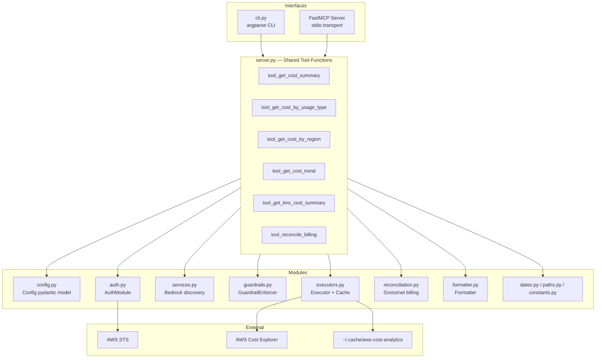

# Design Document

## Overview

kiro-aws-cost-analytics is a read-only AWS Cost Explorer analysis tool for **Bedrock ecosystem** spend, **Kiro** billing, and **account-level billing reconciliation**. It exposes **six** query tools through both a FastMCP MCP server (`aws-cost-analytics`, stdio) and a CLI (`aws-cost-analytics-cli`), sharing a single set of `tool_*` orchestration functions.

Bedrock tools default to a rolling 30-day UTC window. Billing tools (`get-kiro-cost-summary`, `reconcile-billing`) default to the **full current calendar month** to align with the AWS Billing console. The system enforces read-only guardrails via an explicit API action allowlist and scoped SERVICE filters (Bedrock ecosystem discovery or Kiro only). Results are cached under `~/.cache/aws-cost-analytics/` with configurable TTL and formatted as truncated markdown tables optimized for low-token consumption.

The architecture mirrors kiro-aws-firewall-analytics: `server.py` contains tool functions and MCP registration, `cli.py` imports those functions directly, and supporting modules handle config, authentication, guardrails, service discovery, reconciliation, Cost Explorer execution, caching, and formatting.

### Tool catalog

| Tool | Scope | Default dates |
|------|-------|---------------|
| `get-cost-summary` | Bedrock ecosystem | Rolling 30 days → today (UTC) |
| `get-cost-by-usage-type` | Bedrock ecosystem | Rolling 30 days |
| `get-cost-by-region` | Bedrock ecosystem | Rolling 30 days |
| `get-cost-trend` | Bedrock ecosystem | Rolling 30 days |
| `get-kiro-cost-summary` | Kiro subscription, credits, usage | Full calendar month |
| `reconcile-billing` | Gross vs net, record types, service table | Full calendar month |

## Architecture



### Request Flow

Each tool function follows the same orchestration sequence:

1. **Config** — Load and validate `config.json` (or use defaults)
2. **Auth** — Resolve credentials via boto3 chain, call STS GetCallerIdentity for account ID
3. **Validate** — Check input parameters (dates, granularity, group_by); billing tools use calendar-month defaults
4. **Service discovery** (Bedrock tools) — Resolve Bedrock ecosystem SERVICE values via `GetDimensionValues`, cached in `ce-services-bedrock.json`
5. **Guardrail** — Verify CE action is allowlisted and filter uses only approved SERVICE values (Bedrock ecosystem or Kiro)
6. **Cache check** — Derive cache key; if valid cache exists and end_time ≠ today (UTC), return cached result
7. **Execute** — Call Cost Explorer API (or reconciliation helpers for billing tools)
8. **Cache write** — If end_time ≠ today (UTC), persist result JSON to `~/.cache/aws-cost-analytics/`
9. **Format** — Convert raw response to markdown table with summary line, truncate at 50 rows

## Components and Interfaces

### config.py — Config

```python
from pydantic import BaseModel, field_validator
from typing import Optional
import json
from pathlib import Path

class Config(BaseModel):
    region: str = ""  # empty means "resolve from boto3/fallback to us-east-1"
    cache_ttl_hours: int = 24

    @field_validator("region")
    @classmethod
    def validate_region(cls, v: str) -> str:
        """Validate AWS region format if provided."""
        ...

    @field_validator("cache_ttl_hours")
    @classmethod
    def validate_cache_ttl(cls, v: int) -> int:
        """Ensure 1 <= cache_ttl_hours <= 168."""
        ...

    class Config:
        extra = "forbid"  # reject unrecognized fields


def load_config(path: Path = Path("config.json")) -> Config:
    """Load config from JSON file, return defaults if file missing."""
    ...
```

**Design Decisions:**
- `extra = "forbid"` on the pydantic model causes unrecognized fields to raise a `ValidationError`, satisfying Requirement 1.7.
- An empty `region` string signals "resolve at runtime" rather than using `Optional[str]`, keeping the JSON schema simple.

### auth.py — AuthModule

```python
import boto3
from dataclasses import dataclass

@dataclass
class AuthResult:
    account_id: str
    session: boto3.Session

class AuthModule:
    def __init__(self, region: str):
        self._region = region

    def get_credentials(self) -> AuthResult:
        """
        Resolve credentials via default boto3 chain.
        Call STS GetCallerIdentity (10s timeout) to obtain account ID.
        Return AuthResult with account_id and Session scoped to configured region.
        Raises AuthError on credential resolution failure or STS timeout.
        """
        ...
```

**Design Decisions:**
- Region resolution happens in `get_credentials()`: if Config.region is empty, read `session.region_name`; if that is None, fall back to `us-east-1`.
- STS call uses `config=botocore.config.Config(connect_timeout=5, read_timeout=5)` to enforce the 10-second total budget.
- Returns a structured `AuthResult` rather than a tuple for clarity.

### guardrails.py — GuardrailEnforcer

```python
from typing import Any

ALLOWED_ACTIONS: frozenset[str] = frozenset({"GetCostAndUsage", "GetDimensionValues"})

class GuardrailEnforcer:
    def validate(self, action: str, filters: list[dict[str, Any]]) -> None:
        """Legacy list-style filter check (tests). Requires Bedrock ecosystem SERVICE."""
        ...

    def validate_get_dimension_values(self, dimension: str, search_string: str | None) -> None:
        """Only SERVICE dimension with SearchString 'Bedrock' permitted."""
        ...

    def validate_cost_filter(
        self, action: str, ce_filter: dict[str, Any], allowed_services: frozenset[str]
    ) -> None:
        """
        Reject if action not in ALLOWED_ACTIONS.
        Reject if filter SERVICE values are outside allowed_services.
        Kiro queries must filter exactly SERVICE = Kiro.
        Bedrock queries must use only discovered Bedrock ecosystem services.
        """
        ...
```

**Design Decisions:**
- `frozenset` for the allowlist makes it immutable at the module level.
- Exact string comparison on action names (not startswith/prefix).
- `validate_cost_filter()` supports OR filters for multiple Bedrock-related SERVICE values.
- `GetDimensionValues` is restricted to `SERVICE` + `SearchString=Bedrock` for discovery only.

### services.py — Bedrock Ecosystem Discovery

```python
def discover_bedrock_services(ce_client, cache_ttl_hours: int) -> list[str]:
    """
    Call GetDimensionValues(SERVICE, SearchString=Bedrock).
    Cache result in ~/.cache/aws-cost-analytics/ce-services-bedrock.json (version 3).
    Fall back to ['Amazon Bedrock'] if discovery fails or returns incomplete data.
  """

def prepare_bedrock_cost_filter(ce_client, cache_ttl_hours: int) -> dict[str, Any]:
    """Discover services, build single- or OR-SERVICE CE filter, return filter + allowed set."""
```

**Design Decisions:**
- Discovery lookback: 90 days; cache TTL from config.
- Incomplete discovery (fallback-only list) is not cached.
- `service_list_hash()` stabilizes cache keys when the discovered service set changes.

### reconciliation.py — Billing Reconciliation

```python
def get_record_type_summary(ce_client, start: date, end: date) -> RecordTypeSummary:
    """Group by RECORD_TYPE: gross before credits, credits, net."""

def get_kiro_summary(ce_client, start: date, end: date) -> KiroSummary:
    """Kiro subscription, credits, usage, net; usage type from top USAGE_TYPE group."""

def get_gross_service_breakdown(ce_client, start: date, end: date) -> dict[str, float]:
    """All services, gross (no credit netting) for reconcile table."""

def format_reconciliation(...) -> str:
    """Markdown: record types, Kiro breakdown, service table, gross vs net summary."""
```

**Design Decisions:**
- Reconcile uses `RECORD_TYPE` and unfiltered SERVICE grouping (guardrails allow these query shapes).
- Aligns with Billing console when the period is a **full calendar month**.
- `is_full_calendar_month()` gates messaging when the range is partial.

### dates.py / paths.py / constants.py

- **dates.py** — `today_utc()`, `calendar_month_period()`, `is_full_calendar_month()`, `ce_end_exclusive()`.
- **paths.py** — `default_cache_dir()` → `~/.cache/aws-cost-analytics/`.
- **constants.py** — `MCP_SERVER_NAME`, `TOOL_NAMES`, billing vs Bedrock tool sets, rolling-day bounds.

### executors.py — Executor

```python
from pathlib import Path
from datetime import date, datetime, timezone
from typing import Optional
import json

class Executor:
    def __init__(self, session, account_id: str, cache_ttl_hours: int):
        self._ce_client = session.client("ce")
        self._account_id = account_id
        self._cache_ttl_hours = cache_ttl_hours
        self._cache_dir = default_cache_dir()  # ~/.cache/aws-cost-analytics

    def get_cost_and_usage(
        self,
        start_time: date,
        end_time: date,
        granularity: str = "DAILY",
        group_by: Optional[dict] = None,
    ) -> dict:
        """
        1. Derive cache key from (account_id, tool, start, end, granularity, group_by)
        2. If end_time != today(UTC): check cache, return if fresh
        3. Call CE GetCostAndUsage with:
           - TimePeriod.Start = start_time (YYYY-MM-DD)
           - TimePeriod.End = end_time + 1 day (exclusive)
           - Metrics = ["UnblendedCost"]
           - Filter = Bedrock ecosystem (from services.py) or Kiro for billing tools
           - Granularity = granularity
           - GroupBy = [group_by] if provided
        4. If end_time != today(UTC): write result to cache
        5. Return raw CE response dict
        """
        ...

    def _cache_key(self, tool: str, start: date, end: date, gran: str, group: str) -> str:
        """Generate filename: ce-{account}-{tool}-{start}-{end}-{gran}-{group}.json"""
        ...

    def _is_cache_fresh(self, path: Path) -> bool:
        """Check file mtime < cache_ttl_hours ago."""
        ...
```

**Design Decisions:**
- Cache key includes all query-shaping parameters to avoid collisions.
- Cache bypass when `end_time == today` ensures current-day data is always live.
- The executor creates `~/.cache/aws-cost-analytics/` on first write (`mkdir(parents=True, exist_ok=True)`).
- Invalid cache files (unreadable or malformed JSON) are treated as cache misses.

### formatter.py — Formatter

```python
from datetime import date
from typing import Optional

MAX_ROWS = 50
TRUNCATION_FOOTER = "Narrow date range or use a specific group-by"

class Formatter:
    def format_summary(
        self, account_id: str, start: date, end: date, results: dict
    ) -> str:
        """
        Sum Amount across all ResultsByTime, round to 2dp.
        Return: "Account {id} | {start} → {end} | Total: ${amount} USD"
        """
        ...

    def format_table(
        self,
        account_id: str,
        start: date,
        end: date,
        results: dict,
        columns: list[str],
        group_key: Optional[str] = None,
    ) -> str:
        """
        1. Produce summary line
        2. Build markdown table with header + separator
        3. Aggregate rows (one per group value across time range)
        4. Sort by amount descending
        5. Truncate at MAX_ROWS, append footer if truncated
        6. Return combined string
        """
        ...

    def format_trend(
        self,
        account_id: str,
        start: date,
        end: date,
        results: dict,
        group_key: Optional[str] = None,
    ) -> str:
        """
        1. Produce summary line
        2. Build markdown table: date, [group], amount
        3. Rows ordered chronologically (CE natural order)
        4. Truncate at MAX_ROWS
        5. Return combined string
        """
        ...
```

**Design Decisions:**
- Separate methods for summary-only, grouped-aggregated tables, and trend tables because their row structures differ.
- Amounts always formatted with `f"{val:.2f}"` for consistency.
- Truncation happens after sorting/ordering to preserve the most useful rows.
- Zero-result case returns a descriptive message instead of an empty table.

### server.py — Shared Tool Functions + MCP Registration

```python
from mcp.server.fastmcp import FastMCP
from datetime import date
from typing import Optional

mcp_server = FastMCP("aws-cost-analytics")

@mcp_server.tool()
async def tool_get_cost_summary(
    start_time: Optional[str] = None,
    end_time: Optional[str] = None,
) -> str:
    """Get total Amazon Bedrock spend for the given period."""
    ...

@mcp_server.tool()
async def tool_get_cost_by_usage_type(
    start_time: Optional[str] = None,
    end_time: Optional[str] = None,
) -> str:
    """Get Bedrock spend broken down by usage type."""
    ...

@mcp_server.tool()
async def tool_get_cost_by_region(
    start_time: Optional[str] = None,
    end_time: Optional[str] = None,
) -> str:
    """Get Bedrock spend broken down by region."""
    ...

@mcp_server.tool()
async def tool_get_cost_trend(
    start_time: Optional[str] = None,
    end_time: Optional[str] = None,
    granularity: str = "DAILY",
    group_by: Optional[str] = None,
) -> str:
    """Get Bedrock spend as a time series (daily or monthly)."""
    ...

@mcp_server.tool()
async def tool_get_kiro_cost_summary(
    start_time: Optional[str] = None,
    end_time: Optional[str] = None,
) -> str:
    """Get Kiro subscription, credits, usage, and net for a calendar month."""
    ...

@mcp_server.tool()
async def tool_reconcile_billing(
    start_time: Optional[str] = None,
    end_time: Optional[str] = None,
) -> str:
    """Reconcile dashboard gross spend vs net tool totals and Kiro breakdown."""
    ...
```

Each Bedrock tool function internally:
1. Calls `load_config()`
2. Calls `AuthModule(region).get_credentials()`
3. Validates rolling date range (default today−30 → today UTC)
4. Calls `prepare_bedrock_cost_filter()` for discovery + guardrail scope
5. Calls `GuardrailEnforcer().validate_cost_filter()`
6. Calls `Executor(...).get_cost_and_usage()`
7. Calls `Formatter().format_*()`
8. Returns formatted markdown string

Billing tools (`tool_get_kiro_cost_summary`, `tool_reconcile_billing`) use `calendar_month_period()` when dates are omitted and delegate to `reconciliation.py`.

### cli.py — CLI Interface

```python
import argparse
import asyncio
import sys
from aws_cost_analytics.server import (
    tool_get_cost_summary,
    tool_get_cost_by_usage_type,
    tool_get_cost_by_region,
    tool_get_cost_trend,
    tool_get_kiro_cost_summary,
    tool_reconcile_billing,
)

def main():
    parser = argparse.ArgumentParser(prog="aws-cost-analytics")
    subparsers = parser.add_subparsers(dest="command", required=True)
    # ... register six subcommands with --start-time, --end-time, --days, etc.
    args = parser.parse_args()
    # Validate --days mutual exclusivity with --start-time/--end-time
    # Convert --days to start_time/end_time (Bedrock tools only)
    # Billing subcommands ignore --days; use calendar month or explicit dates
    # Call appropriate tool_* function via asyncio.run()
    # Print result to stdout, errors to stderr
    ...
```

**Design Decisions:**
- CLI uses `asyncio.run()` to invoke async tool functions, keeping them identical to MCP invocations.
- `--days` is a Bedrock-tool convenience only; billing tools use calendar-month defaults when dates omitted.
- Exit code 0 on success, non-zero on any error.

## Date Semantics

| Context | Default `start_time` | Default `end_time` |
|---------|-------------------|-------------------|
| Bedrock tools | Today − 30 days (UTC) | Today (UTC) |
| Billing tools | First day of current month | Last day of current month |

User-facing dates are **inclusive** `YYYY-MM-DD`. Cost Explorer `TimePeriod.End` is **exclusive** (`end_time + 1 day`). All “today” calculations use UTC.

## Data Models

### Config JSON Schema

```json
{
  "region": "us-east-1",
  "cache_ttl_hours": 24
}
```

| Field | Type | Default | Constraints |
|-------|------|---------|-------------|
| region | string | boto3 default or `us-east-1` | Pattern: `[a-z]{2,4}-[a-z]+-\d{1,2}` |
| cache_ttl_hours | int | 24 | 1–168 inclusive |

### AuthResult

| Field | Type | Description |
|-------|------|-------------|
| account_id | str | 12-digit AWS account ID from STS |
| session | boto3.Session | Session scoped to resolved region |

### Cache File Naming

Pattern: `~/.cache/aws-cost-analytics/ce-{account_id}-{scope}-{tool}-{start}-{end}-{granularity}-{group_by}.json`

Bedrock service discovery: `~/.cache/aws-cost-analytics/ce-services-bedrock.json`

Example: `~/.cache/aws-cost-analytics/ce-123456789012-bedrock-abc-cost-trend-2024-01-01-2024-01-31-DAILY-USAGE_TYPE.json`

| Segment | Source |
|---------|--------|
| account_id | STS GetCallerIdentity |
| tool | Tool name without `get-` prefix (e.g., `cost-summary`) |
| start | start_time YYYY-MM-DD |
| end | end_time YYYY-MM-DD |
| granularity | DAILY, MONTHLY, or `none` |
| group_by | USAGE_TYPE, REGION, or `none` |

### Cost Explorer Request Parameters

| Parameter | Value |
|-----------|-------|
| TimePeriod.Start | start_time (inclusive, YYYY-MM-DD) |
| TimePeriod.End | end_time + 1 day (exclusive, YYYY-MM-DD) |
| Metrics | ["UnblendedCost"] |
| Filter | Bedrock: OR of discovered `SERVICE` values; Kiro: `SERVICE = Kiro`; Reconcile: varies by query (RECORD_TYPE, SERVICE) |
| Granularity | DAILY or MONTHLY |
| GroupBy | [{"Type": "DIMENSION", "Key": "<dimension>"}] or omitted |

### Formatter Output Structure

**Summary line format:**
```
Account 123456789012 | 2024-01-01 → 2024-01-31 | Total: $142.57 USD
```

**Table format (grouped):**
```markdown
| Usage Type | Amount (USD) |
|---|---|
| USE2-Titan-TextLite-Input | 85.32 |
| USE2-Titan-TextLite-Output | 42.10 |
| ... | ... |
```

**Trend format (ungrouped):**
```markdown
| Date | Amount (USD) |
|---|---|
| 2024-01-01 | 4.52 |
| 2024-01-02 | 5.10 |
| ... | ... |
```

## Correctness Properties

*A property is a characteristic or behavior that should hold true across all valid executions of a system — essentially, a formal statement about what the system should do. Properties serve as the bridge between human-readable specifications and machine-verifiable correctness guarantees.*

### Property 1: Region validation accepts only valid AWS region patterns

*For any* string, the Config validator SHALL accept it if and only if it matches the pattern `[a-z]{2,4}-[a-z]+-\d{1,2}`. All non-matching strings SHALL be rejected with a validation error.

**Validates: Requirements 1.1**

### Property 2: Cache TTL range validation

*For any* integer value, the Config validator SHALL accept it as `cache_ttl_hours` if and only if it is in the range [1, 168] inclusive. Values outside this range SHALL be rejected.

**Validates: Requirements 1.5**

### Property 3: Unrecognized config fields are rejected

*For any* JSON object containing a field name that is not `region` or `cache_ttl_hours`, the Config_Loader SHALL reject the config with an error message that identifies the unrecognized field name.

**Validates: Requirements 1.7**

### Property 4: Guardrail action allowlist is exact-match only

*For any* action string, the GuardrailEnforcer SHALL accept it if and only if it is exactly `"GetCostAndUsage"` or `"GetDimensionValues"`. Strings that are prefixes, suffixes, superstrings, or case-variants of the allowed actions SHALL be rejected.

**Validates: Requirements 3.1, 3.2, 3.3**

### Property 5: Guardrail requires approved SERVICE filter scope

*For any* Cost Explorer filter, `validate_cost_filter()` SHALL accept it only when all `SERVICE` dimension values are within the caller-supplied `allowed_services` set. Bedrock ecosystem values must match discovered Bedrock-related services; Kiro queries must use exactly `Kiro`. Filter lists that omit SERVICE or include disallowed values SHALL be rejected.

**Validates: Requirements 3.4, 3.5**

### Property 6: Date validation accepts only real calendar dates

*For any* string input to `start_time` or `end_time`, the system SHALL accept it if and only if it represents a valid calendar date in `YYYY-MM-DD` format (e.g., `2024-02-29` is valid in a leap year but `2024-02-30` is never valid).

**Validates: Requirements 4.1**

### Property 7: Start-time must not be after end-time

*For any* pair of valid dates (`start_time`, `end_time`) where `start_time` is strictly after `end_time`, the system SHALL reject the request with an error indicating the ordering constraint.

**Validates: Requirements 4.2**

### Property 8: Granularity and group_by enum validation

*For any* string provided as `granularity`, the system SHALL accept it if and only if it is exactly `"DAILY"` or `"MONTHLY"`. *For any* string provided as `group_by`, the system SHALL accept it if and only if it is exactly `"USAGE_TYPE"` or `"REGION"` (or is omitted/null).

**Validates: Requirements 4.4, 4.5, 4.6, 4.7**

### Property 9: Days parameter range validation

*For any* integer provided as the `--days` CLI parameter, the CLI SHALL accept it if and only if it is in the range [1, 365] inclusive. Values outside this range SHALL be rejected.

**Validates: Requirements 4.8, 4.9**

### Property 10: Date-range to Cost Explorer mapping

*For any* valid inclusive date range (`start_time`, `end_time`), the Executor SHALL construct a CE `TimePeriod` where `Start` equals `start_time` and `End` equals `end_time` plus one calendar day. The resulting `End` date SHALL always be strictly after `Start`.

**Validates: Requirements 5.4, 6.3, 7.3, 8.6**

### Property 11: Summary computation sums and rounds correctly

*For any* Cost Explorer response containing a `ResultsByTime` array with `Amount` strings, the Formatter SHALL compute a total equal to the sum of all amounts, rounded to exactly 2 decimal places, and produce a summary line containing the account ID, the inclusive user-facing date range, and the total in `$X.XX USD` format.

**Validates: Requirements 5.6, 9.1**

### Property 12: Grouped table aggregation and sort order

*For any* Cost Explorer grouped response with multiple time periods and group values, the Formatter SHALL produce a markdown table where: (a) each unique group value appears exactly once, (b) its amount is the sum of that group's amounts across all time periods rounded to 2 decimal places, and (c) rows are sorted by amount in descending order.

**Validates: Requirements 6.5, 6.6, 7.5, 7.6**

### Property 13: Truncation at 50 rows with footer

*For any* formatted output with more than 50 data rows, the Formatter SHALL include exactly 50 data rows (preserving original order) and append the footer message `"Narrow date range or use a specific group-by"`. For outputs with 50 or fewer rows, no truncation or footer SHALL occur.

**Validates: Requirements 9.3, 9.4**

### Property 14: Cache key uniqueness

*For any* two distinct parameter tuples (`account_id`, `tool`, `start_time`, `end_time`, `granularity`, `group_by`), the Executor SHALL produce distinct cache keys. Conversely, identical parameter tuples SHALL always produce the same cache key.

**Validates: Requirements 10.1**

## Error Handling

### Error Categories

| Category | Source | Behavior |
|----------|--------|----------|
| Config parse error | Malformed JSON in config.json | Descriptive message identifying parse failure |
| Config validation error | Invalid field values or unrecognized fields | Descriptive message identifying the field and constraint |
| Auth credential error | boto3 credential chain fails | Message indicating credential resolution failure |
| Auth STS error | GetCallerIdentity fails or times out | Message distinguishing timeout from other STS failures |
| Input validation error | Invalid dates, ranges, enums | Message identifying the invalid parameter and accepted values |
| Guardrail violation | Blocked action or missing Bedrock filter | Message identifying the blocked action or filter violation |
| CE API error | Cost Explorer call fails | Descriptive message without raw exception details |
| Cache read error | Corrupted or unreadable cache file | Silent fallback to cache miss (call CE) |

### Error Propagation Strategy

1. **Modules raise typed exceptions** — Each module defines its own exception class (`ConfigError`, `AuthError`, `GuardrailError`, `ExecutorError`).
2. **Tool functions catch and wrap** — The `tool_*` functions catch module exceptions and return user-friendly error messages (not raw tracebacks).
3. **CLI prints to stderr** — Errors are printed to stderr with non-zero exit code.
4. **MCP returns error response** — MCP framework handles exceptions as error content blocks.
5. **No raw exceptions exposed** — Users never see Python tracebacks or boto3 internals.

### Timeout Strategy

| Call | Timeout | Behavior |
|------|---------|----------|
| STS GetCallerIdentity | 10s (5s connect + 5s read) | Raise AuthError with timeout indication |
| CE GetCostAndUsage | boto3 default (60s) | Raise ExecutorError with CE failure indication |
| Cache file I/O | None (local disk) | On error, treat as cache miss |

## Testing Strategy

### Testing Approach

The project uses a dual testing approach:
- **Property-based tests** (Hypothesis) — verify universal properties across randomized inputs
- **Unit tests** (pytest) — verify specific examples, edge cases, and integration points

### Property-Based Testing (Hypothesis)

Library: **Hypothesis** (Python property-based testing framework)

Configuration:
- Minimum 100 examples per property test (`@settings(max_examples=100)`)
- Each test tagged with feature and property reference

Target modules for PBT:
- `config.py` — validation logic (Properties 1, 2, 3)
- `guardrails.py` — allowlist and filter enforcement (Properties 4, 5)
- `formatter.py` — output formatting, aggregation, truncation (Properties 11, 12, 13)
- `executors.py` — date mapping and cache key derivation (Properties 10, 14)
- Input validation functions — date parsing, enum checks (Properties 6, 7, 8, 9)

### Unit Testing (pytest)

Target areas:
- Auth module with mocked boto3/STS (credential resolution, error paths, timeout)
- Default date calculations (today-30, today)
- CLI argument parsing (mutual exclusivity, subcommand registration)
- MCP tool registration (correct names, transport mode)
- End-to-end tool invocation with mocked CE responses
- Cache hit/miss scenarios
- Zero-result formatting edge cases

### Mocking Strategy

- **moto** — mock AWS services (STS, Cost Explorer) for integration tests
- **unittest.mock** — patch boto3 Session for unit tests
- **pytest-asyncio** — handle async tool function invocation
- **tmp_path fixture** — isolated cache directory for file I/O tests

### Test File Organization

```
tests/
├── test_config.py              # Config validation properties + unit tests
├── test_config_properties.py
├── test_guardrails_properties.py
├── test_executors.py           # Date mapping, cache key, cache behavior
├── test_executors_properties.py
├── test_formatter.py           # Formatting properties (summary, tables, truncation)
├── test_formatter_properties.py
├── test_input_validation.py    # Date, granularity, group_by, days validation
├── test_auth.py                # Auth module unit tests (mocked)
├── test_cli.py                 # CLI argument parsing and integration
├── test_server.py              # MCP registration and tool invocation (6 tools)
├── test_services.py            # Bedrock discovery and filter building
├── test_reconciliation.py      # Gross/net, Kiro summary, reconcile output
├── test_dates.py               # Calendar month helpers
├── test_paths.py               # Cache directory paths
└── test_constants.py           # Public contract constants
```

### Continuous Integration

GitHub Actions workflow `.github/workflows/ci.yml` runs on pull requests to `main`:

- Python **3.11** (minimum supported) and **3.14** (latest stable)
- `pip install -e ".[dev]"` then `pytest -q`
- No live AWS credentials required (moto + mocks)

### Test Tagging Convention

Each property-based test includes a docstring tag:
```python
# Feature: aws-cost-analytics, Property 4: Guardrail action allowlist is exact-match only
```

