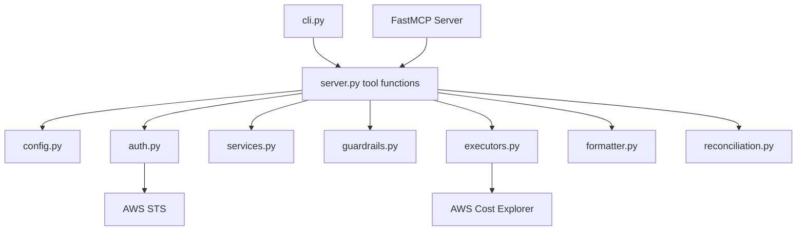

# kiro-aws-cost-analytics

Read-only AWS Cost Explorer analysis for **Bedrock ecosystem** and **Kiro** spend. Working **MCP server** (6 tools) + CLI — install from GitHub; no clone required.

**Repository:** [github.com/jajera/kiro-aws-cost-analytics](https://github.com/jajera/kiro-aws-cost-analytics)

## Prerequisites

- Python 3.11+
- [uv](https://docs.astral.sh/uv/) (`uvx`) **or** [pipx](https://pipx.pypa.io/)
- AWS credentials (`~/.aws`, environment variables, or instance role)
- IAM: `ce:GetCostAndUsage`, `ce:GetDimensionValues`, `sts:GetCallerIdentity`

## Quick start (MCP) — anyone

No repo clone. Merge into your MCP config (Cursor `~/.cursor/mcp.json`, Kiro `.kiro/settings/mcp.json`).

**Recommended** — run from GitHub via `uvx` ([mcp.json.example](mcp.json.example)):

```json
{
  "mcpServers": {
    "aws-cost-analytics": {
      "command": "uvx",
      "args": [
        "--from",
        "git+https://github.com/jajera/kiro-aws-cost-analytics.git@main",
        "aws-cost-analytics"
      ]
    }
  }
}
```

Pin a release tag when available (e.g. `@v0.2.0` instead of `@main`).

Credentials come from your environment — **do not** commit `AWS_PROFILE` or keys in MCP config.

Restart the IDE, then confirm **6 tools** appear under `aws-cost-analytics`. Try: *"Run reconcile-billing"*.

### MCP tools

| Tool | Purpose |
|------|---------|
| `get-cost-summary` | Bedrock ecosystem net total |
| `get-cost-by-usage-type` | Bedrock by usage type |
| `get-cost-by-region` | Bedrock by region |
| `get-cost-trend` | Bedrock time series |
| `get-kiro-cost-summary` | Kiro subscription / credits / net (calendar month) |
| `reconcile-billing` | Dashboard gross vs tool net (calendar month) |

See [docs/api-contract.md](docs/api-contract.md). Playbooks: `.kiro/steering/`.

### vs AWS Labs Billing MCP

[AWS Billing and Cost Management MCP](https://awslabs.github.io/mcp/servers/billing-cost-management-mcp-server) covers broad FinOps (budgets, RI, anomalies, etc.). This server is **narrow**: Bedrock discovery, Kiro billing, dashboard reconciliation. They complement each other.

## Install (CLI)

### From GitHub — no clone (`uvx`, one-shot)

```bash
uvx --from git+https://github.com/jajera/kiro-aws-cost-analytics.git@main aws-cost-analytics-cli reconcile-billing
```

### From GitHub — persistent (`pipx`)

```bash
pipx install git+https://github.com/jajera/kiro-aws-cost-analytics.git
aws-cost-analytics-cli --help
aws-cost-analytics          # MCP entry point (if configured without uvx)
```

### From PyPI (when published)

```bash
pipx install aws-cost-analytics
```

### Developers (editable install)

```bash
git clone https://github.com/jajera/kiro-aws-cost-analytics.git
cd kiro-aws-cost-analytics
python3 -m venv .venv && source .venv/bin/activate
pip install -e ".[dev]"
pytest
```

## CLI examples

```bash
aws-cost-analytics-cli get-cost-summary --days 30
aws-cost-analytics-cli get-cost-by-usage-type --days 30
aws-cost-analytics-cli get-cost-by-region --days 30
aws-cost-analytics-cli get-cost-trend --days 14 --granularity DAILY
aws-cost-analytics-cli get-cost-trend --days 14 --group-by USAGE_TYPE
aws-cost-analytics-cli get-kiro-cost-summary
aws-cost-analytics-cli reconcile-billing
```

`get-kiro-cost-summary` and `reconcile-billing` use the **full current calendar month** (Billing dashboard alignment). `--days` is ignored for those two.

```bash
aws-cost-analytics-cli get-cost-summary --start-time 2024-01-01 --end-time 2024-01-31
```

`--days` range: 1–365. Dates are **UTC**.

## Configuration

Optional local file (gitignored):

```bash
cp config.json.example config.json
```

| Field | Default | Description |
|-------|---------|-------------|
| `region` | boto3 default or `us-east-1` | AWS region |
| `cache_ttl_hours` | `24` | CE cache TTL (1–168 hours) |

**Cache directory:** `~/.cache/aws-cost-analytics/` (CE responses and Bedrock service discovery). Not stored in the repo.

- **Bedrock tools** — ecosystem via `GetDimensionValues` search `Bedrock`
- **Kiro tool** — `SERVICE = Kiro`
- **Reconcile** — full account gross vs net

## Reconcile "Where Is My Cost?"

Billing widget = **gross before credits**, **full calendar month**. Bedrock/Kiro tools = **net**, rolling window by default.

| Line | Example (June) |
|------|----------------|
| Kiro subscription | $13.70 |
| Other usage + tax | $2.33 |
| **Gross** | **$16.03** |
| Credits | -$15.58 |
| **Net** | **$0.45** |

```bash
uvx --from git+https://github.com/jajera/kiro-aws-cost-analytics.git@main aws-cost-analytics-cli reconcile-billing
```

## Troubleshooting

| Issue | Fix |
|-------|-----|
| `uvx` not found | Install [uv](https://docs.astral.sh/uv/) |
| MCP tools missing | Restart IDE; verify `uvx` works from a terminal |
| `command not found` (pipx path) | Use `uvx` MCP config above, or `pipx install git+https://...` |
| Bedrock `$0.00` vs console | `rm ~/.cache/aws-cost-analytics/ce-services-bedrock.json`, re-run |
| Total vs dashboard ~$16 | Use `reconcile-billing` (calendar month, gross) |

## Architecture



## License

MIT — see [LICENSE](LICENSE).

## Releases

Pushes to `main` with [Conventional Commits](https://www.conventionalcommits.org/) (`feat:`, `fix:`, etc.) trigger [python-semantic-release](https://python-semantic-release.readthedocs.io/) via `.github/workflows/release.yml`:

1. Merge your PR to `main` (e.g. `feat: add cost analytics MCP server`).
2. The release workflow bumps the version, updates `CHANGELOG.md`, tags `vX.Y.Z`, and creates a [GitHub Release](https://github.com/jajera/kiro-aws-cost-analytics/releases).

No Release PR and no manual tagging. The first `feat:` merge after `0.1.0` publishes **v0.2.0**.

### Pinning installs after a release

```text
git+https://github.com/jajera/kiro-aws-cost-analytics.git@vX.Y.Z
```
